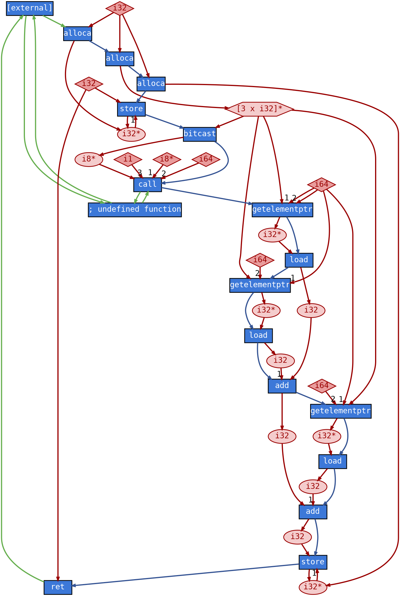

# Perfograph: Numerical Aware Program Graph Representation
Code and package for perfograph as laid out in the paper ["PERFOGRAPH: A Numerical Aware Program Graph Representation for Performance Optimization and Program Analysis](https://arxiv.org/abs/2306.00210).

This repository is designed to create graph representations of source code that are numerically aware, contain composite data structure information, and properly present variables.



## Graph Format
| Node Type Name | Node Type ID | Shape           | Color     | Rounded | 
|----------------|--------------|-----------------|-----------|---------|
| Instruction    | 0            | Rectangle       | Blue      |    No   |
| Variable       | 1            | Ellipse         | Red       |   Yes   |
| Constant       | 2            | Diamond         | Light Red |    No   |
| Variable Array | 3            | Hexagon         | Red       |    No   |
| Variable Vector| 4            | Octagon         | Red       |    No   |
| Constant Array | 5            | Rounded Box     | Light Red |   Yes   |
| Constant Vector| 6            | Parallelogram   | Light Red |    No   |

| Edge Type Name | Edge Type ID | Color |
|----------------|--------------|-------|
| Control        | 0            | Blue  |
| Data           | 1            | Red   |
| Call           | 2            | Green |


## System Requirements
This project requires Graphviz to be installed:

### Linux
`sudo apt-get install graphviz-dev`

### MacOS:
`brew install graphviz`

### A note for MacOS with ARM Architecture
Some of the python dependencies are only available on x86, so you must emulate this environment for the program to work. An example with conda is shown below:

```
brew install miniconda
conda create -n my_x86_env -y
conda activate my_x86_env
conda config --env --set subdir osx-64
conda install python=3.8
conda install graphviz
pip install perfograph
```


## Installation
`pip install git+https://github.com/tehranixyz/perfograph`

## Use Cases
- Program Analysis
- Performance Optimization
- Parallelism Discovery

## Usage
After installing perfograph and the necessary dependencies, you can use perfograph as shown below or in the examples folder:

### Creating a Graph
To create a graph representation of a program, use the 'from_file' function.
```python
import perfograph as pg

G = pg.from_file('path/to/your/file.ll')
```
Parameters:
- 'file': Path to program file
- 'llvm_version': (Optional) Specify the LLVM version for LLVM IR files. Default is '10'
- 'with_vectors': (Optional) Include vector and array information in the graph. Default is 'True'
- 'disable_progress_bar': (Optional) Disable the progress bar display. Default is 'False'

### Exporting Graphs
to_dot
Exports the graph in DOT format. Optionally, can also output in PDF format.
```python
import perfograph as pg

pg.to_dot(G, 'output.dot') # Saves the graph as a DOT file
pg.to_dot(G, 'output.pdf') # Saves a PDF vizualization of the graph
pg.to_dot(G, 'output.png') # Saves a PNG vizualization of the graph
```
to_json
Exports the graph in JSON format. If no file name is provided, returns the JSON object.
```python
import perfograph as pg

pg.to_json(graph, 'output.json') # Saves the graph as a JSON file
graph_json = pg.to_json(graph) # Returns the graph as a JSON string
```

## Error Handling
The module raises 'ValueError' if an unsupported file format is provided or if an invalid output file type is specified.

## License
This project is licensed under the Apache 2.0 License - see the [LICENSE](LICENSE) file for details